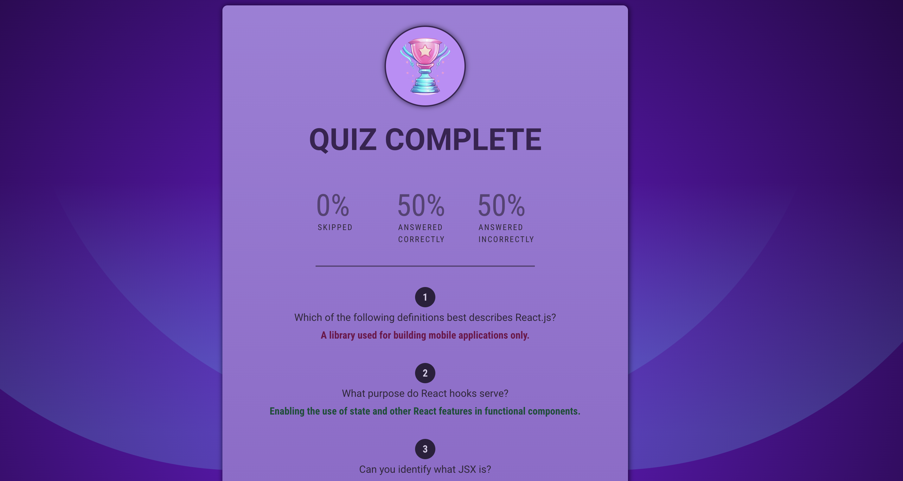

# React Quiz App

This is a simple React Quiz application that allows users to answer multiple-choice questions.

## Features

- Display multiple-choice questions.
- Users can select one option for each question.
- Show the final score at the end of the quiz.

## Setup

1. Clone the repository:

   ```bash
   git clone https://github.com/your-username/react-quiz-app.git
   cd QUIZ-APP
   npm install
   npm run dev
   ```

   The app will be available at http://localhost:5173.

## Usage
    Open the application in your browser.

    Answer the multiple-choice questions.

    Submit your answers to see the final score.


 ## Contributing

Feel free to contribute to the project. Create a pull request, and we'll review it together.

## License

No License.

## Screenshots





